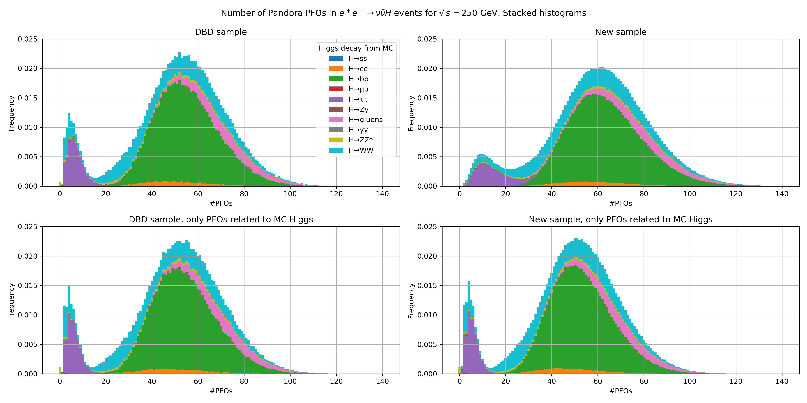

# ILD ννH: DBD vs MC2020

This repository accompanies a [presentation](./doc/vvH_DBD_vs_MC2020.pdf) for
the [ILD Analysis/Software meeting](https://agenda.linearcollider.org/event/9015/)
09.12.2020.

Differences between the ILD DBD samples from 2013 and the new 2020 Monte Carlo
campaign are investigated for a physics analysis.
In accordance with my research interest, we are looking into ννH events.
Starting out with the old and new ννH sample LCIO files,
the following steps are performed:

1. Extract some variables into a rootfile ([make_rootfile](./make_rootfile)).
2. Create interesting plots from the rootfiles ([compare](./compare)).
3. Build a presentation from these files ([doc](./doc)).

## 1. Make the rootfile

Two Marlin processors are created:

- [`OverlayRemoverTruthProcessor`](./make_rootfile/processors/overlay_remover_truth):
  Allows to isolate the effects from the increase of number of overlaid low-pT
  hadrons (per bunch crossing) from actual changes
  in the Higgs boson reconstruction.
- [`MakeHiggsVariablesProcessor`](./make_rootfile/processors/make_higgs_variables):
  Extract some simple variables from the LCIO description of the event.

The python script ([steerer.py](./make_rootfile/steerer.py)) can be readily
used to run the rootfile production on the kek-cc batch farm.
For other locations small adaptions to the [pySteer](https://github.com/kunathj/pySteer)
code might be necessary.

Execute the following steps in your shell in order to produce the rootfiles:

1. `./setup.sh`: Only necessary once after cloning this repository.
2. `make_rootfile/build.sh`: Once after each C++ code change that needs the
   linking to be done again.
3. `make_rootfile/run.sh`: Starts the actual Marlin rn producing the rootfiles.

If you want to avoid the pySteer step, or have problems with its setup,
you can adapt [template_steering.xml](./make_rootfile/template_steering.xml).
This file can used by Marlin directly (`Marlin template_steering.xml`)
after replacing `%LCIO_FILES` with the file paths.

Each run produces two rootfiles:
the sets of event variables with and without overlay.
You will probably have to combine and rename the resulting rootfiles.
To proceed, the following files should be made available in the [data](./data)
directory:

- `new_only_higgs.root`
- `new_with_overlay.root`
- `old_only_higgs.root`
- `old_with_overlay.root`

Processing the (2M new + 200k old) events took about 2 CPU hours.
More than 3/4 of this time was spent in the `OverlayRemoverTruthProcessor`.
If time is an issue, this could probably be significantly sped up. e.g. by
identifying the PFOs related to the Higgs decay starting from the `MCParticlesSkimmed`.
For now, for each PFO the decay chain of the related MCParticle(s) is searched
for a Higgs boson.

## 2. Comparison

The sample comparison and figure production step is performed with Python3.
The necessary packages are specified in the first cell of the Jupyter notebook.
All of them are available via both pip and conda.

If you have access to my rootfiles (e.g. via kek-cc), you can directly start
with this step.

## 3. The presentation

The repository is documented in form of this [README.md](./README.md) and
the [LaTeX presentation](./doc/vvH_DBD_vs_MC2020.pdf) located in [doc](./doc).
